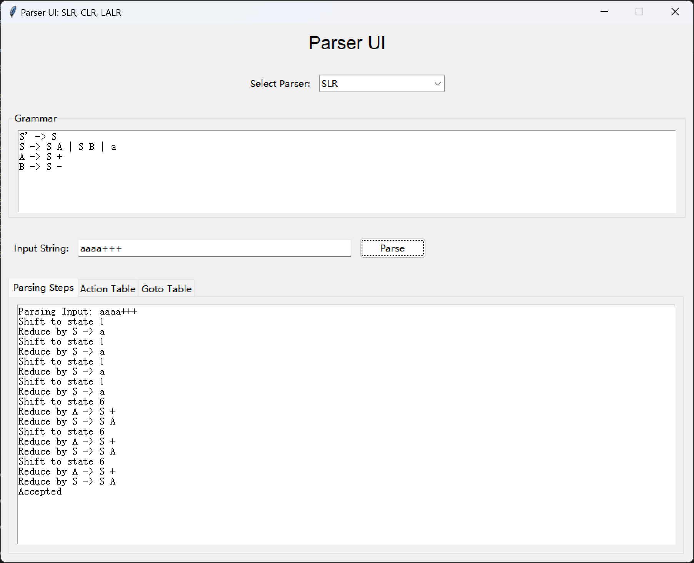

# Compilers

SLR/CLR/LALR parsers for making homework easier...

编译原理学得想死。。。精神状态非常美丽

目前实现了 SLR/CLR/LALR 三种分析器，可以自动构造分析表，自动分析输入串。

欢迎提交 PR。

## Usage

### With UI

```python
python frontend.py
```



### Without UI

See `simple.py` for example.